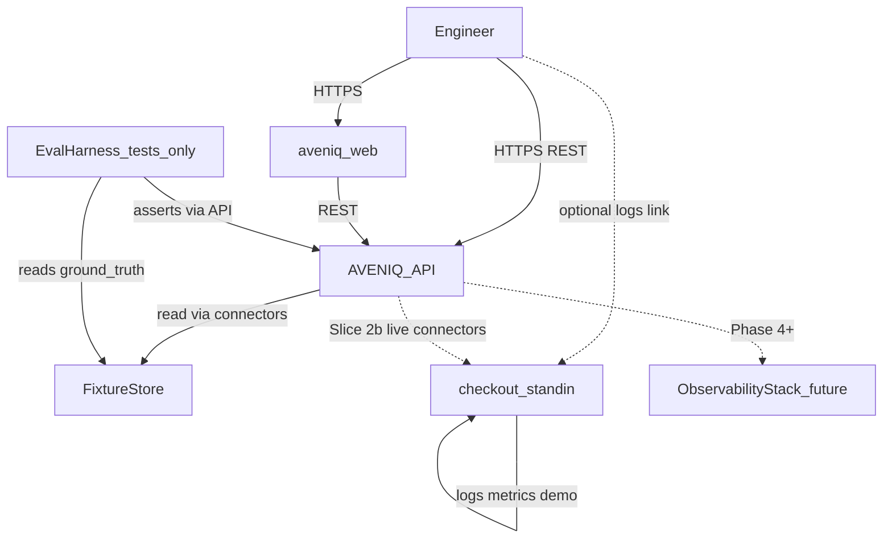

# HLD 01 — System context

Maps to product architecture [`docs/23-architecture.md`](../../docs/23-architecture.md).

## C4 Level 1 — Context

## Actors

| Actor | Interaction |
|-------|-------------|
| **Engineer** | Playground UI or API: run scenarios, inspect evidence and RCA; persona preview in UI (Slice 2). |
| **CI / Jenkins** | Runs pytest, contract tests; compose smoke via `docker-compose.test.yml`. |

## External systems (Phase 0b–2)

| System | Role | Phase |
|--------|------|-------|
| **Fixture store** | Versioned files under `fixtures/{benchmark_id}/` produced by `scripts/build_fixture.py` | 0b–2 (RCA data path) |
| **Ground truth** | `fixtures/{id}/ground_truth.json` — **eval only** | 0b–1 |
| **Checkout stand-in** | Runnable `checkout-api` simulator; playground reset/trigger | Slice 2 |
| **aveniq_web** | Playground + investigation views | Slice 2 |

## External systems (deferred)

| System | Role | Phase |
|--------|------|-------|
| **Prometheus / Loki / Grafana** | Live telemetry and alerts | Phase 4+ |
| **Harbor** | Container registry | Deploy handoff |
| **MCP servers** | Tool exposure to agents | After E2E without MCP |

## Trust boundaries

- AVENIQ treats all connector payloads as **untrusted data** (prompt injection discipline per [`docs/19-security.md`](../../docs/19-security.md)).
- Authorization is **out of scope** for Slice 0–2; Playground routes are **local/demo only**.
- `org_id` / `environment_id` are optional fields for future tenancy.

## Cross-references

- Data flows: [04-data-flows.md](04-data-flows.md)
- Containers: [02-containers.md](02-containers.md)
- Playground: [../lld/10-playground-orchestration.md](../lld/10-playground-orchestration.md)
