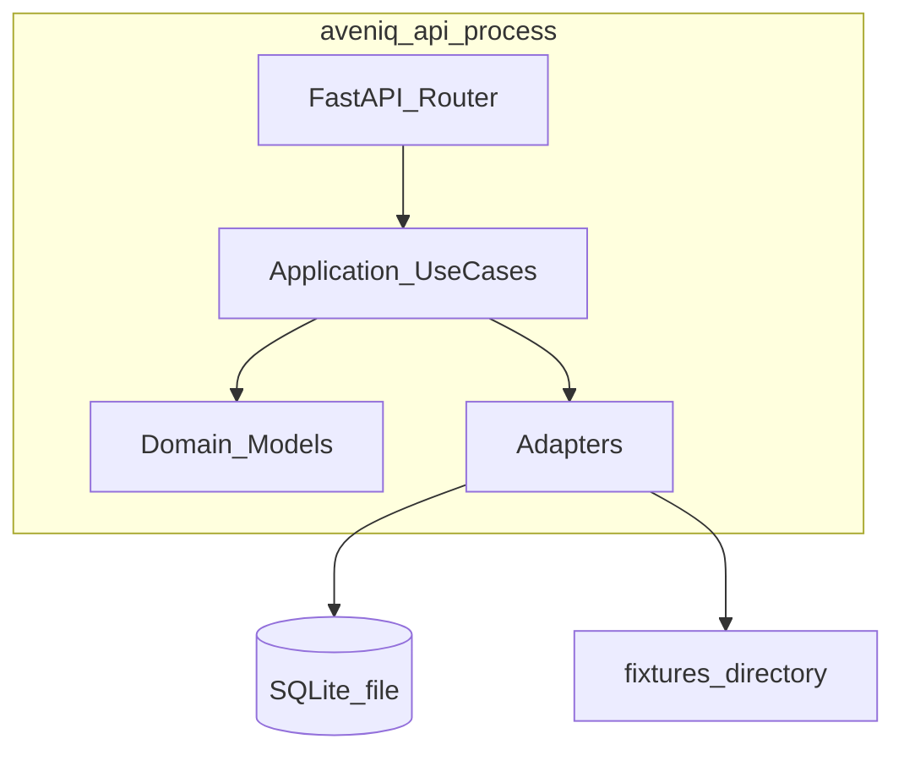
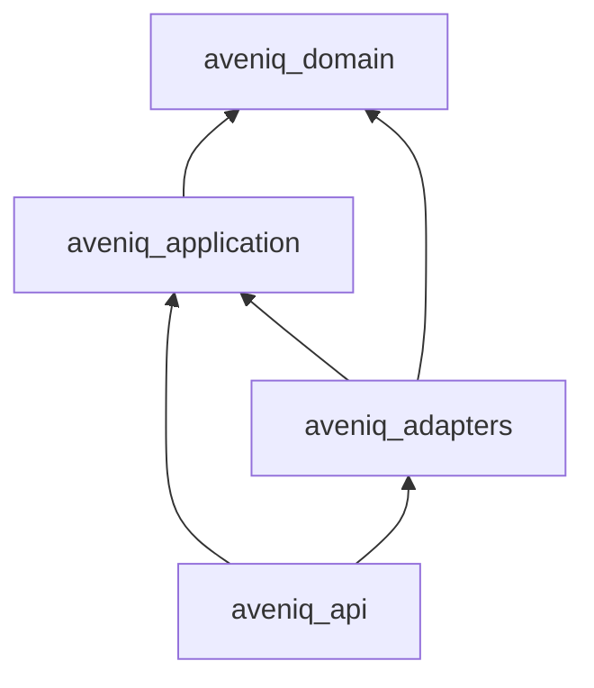

# HLD 02 — Containers and packages

## C4 Level 2 — Containers (Phase 0b–1)

Single deployable **process** (`aveniq_api`) in Phase 0b–1. No separate worker service until investigation jobs are long-running enough to warrant async workers.

## uv workspace packages

| Package | Responsibility |
|---------|----------------|
| `aveniq_domain` | Entities, value objects, state transition rules, domain exceptions |
| `aveniq_application` | `StartInvestigation`, `RunInvestigation`; port `Protocol` definitions |
| `aveniq_adapters` | `SqliteInvestigationRepository`, fixture connectors, OTEL bootstrap |
| `aveniq_api` | HTTP mapping, dependency injection, OpenAPI route binding |

## Dependency diagram

## Runtime configuration

Injected at process start:

- `Settings` (pydantic-settings): paths, connector mode, OTEL endpoints
- `UnitOfWork` or repository factory bound to SQLite path

## Cross-references

- Stack: [../00-stack-and-repo.md](../00-stack-and-repo.md)
- Ports detail: [../lld/03-ports.md](../lld/03-ports.md)
- Deployment: [05-deployment-evolution.md](05-deployment-evolution.md)
