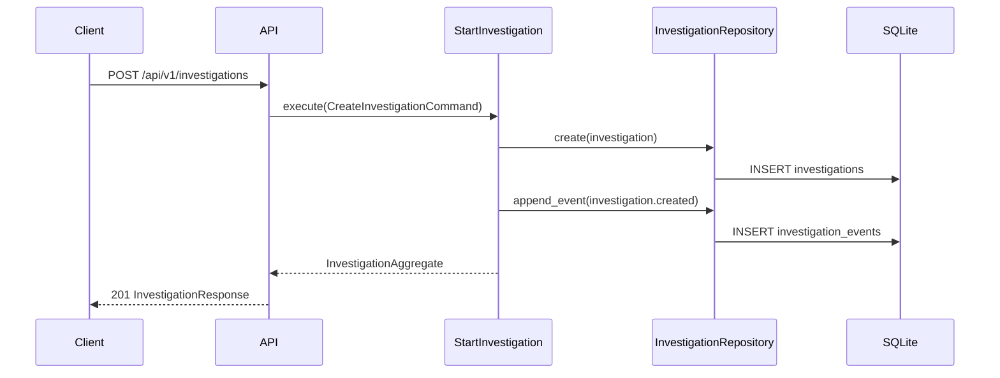
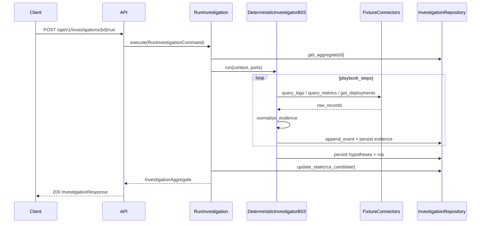
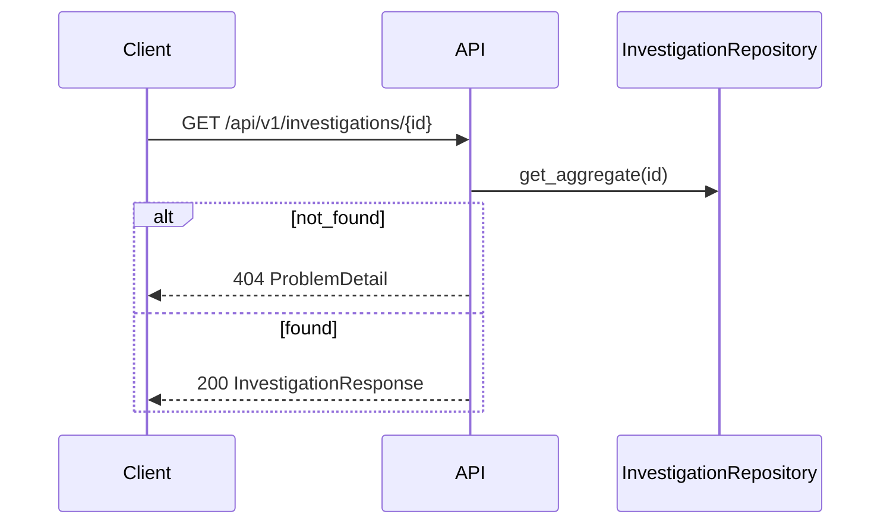

# HLD 03 — Runtime flows

Aligns with [`docs/09-investigation-model.md`](../../docs/09-investigation-model.md).

## Flow 1 — Create investigation

**Slice 0:** Persist investigation + initial signal metadata.  
**Slice 1:** Same; may pre-seed alert evidence from `signal` payload.

## Flow 2 — Run investigation (B03, Slice 1)

## Flow 3 — Get investigation aggregate

Aggregate includes: investigation header, `events[]`, `evidence[]`, `hypotheses[]`, `rca` (nullable until run).

## Flow 4 — Health

`GET /health` — no database required for liveness; optional readiness checks DB in Phase 0b.

## Cross-references

- Use cases: [../lld/02-application-use-cases.md](../lld/02-application-use-cases.md)
- B03 playbook: [../lld/06-deterministic-investigator-b03.md](../lld/06-deterministic-investigator-b03.md)
- API: [../api/openapi.yaml](../api/openapi.yaml)
