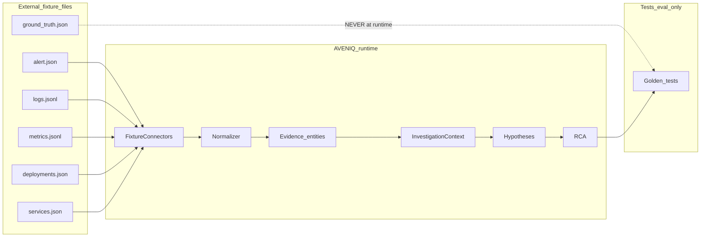

# HLD 04 — Data flows

## Evidence pipeline



## Ground truth isolation (mandatory)

| Artifact | Runtime (API + investigator + connectors) | Tests / eval |
|----------|-------------------------------------------|--------------|
| `fixtures/b03/*.json` (except ground_truth) | **Allowed** | Allowed |
| `fixtures/b03/ground_truth.json` | **Forbidden** | Allowed |

Enforcement (Phase 0b):

- Connectors only open whitelisted filenames (see [../01-fixture-package-spec-v1.md](../01-fixture-package-spec-v1.md)).
- No code path accepts `ground_truth` as a connector parameter.
- CI grep test optional: `ground_truth` not referenced outside `tests/` and `scripts/`.

## Normalization

Raw fixture records → `Evidence` with:

- Stable `evidence_id` (ULID) assigned by investigator or normalization layer
- `provenance.fixture_path`, `provenance.query`, `provenance.retrieved_at`
- `strength`: `direct` | `derived` | `correlated` | `inferred` | `human_provided`

Semantic rules: [`docs/10-evidence-model.md`](../../docs/10-evidence-model.md).

## RCA traceability chain

Documented for design gate:

```text
Rca.claims[].evidence_ids[]
  → Evidence.id
  → Evidence.provenance.fixture_ref (file + line or record index)
  → fixture file record
```

Example: claim “connection utilization reached 99%” → `ev_b03_metric_pool_util` → `metrics/connections.jsonl` record `t=2026-09-28T14:30:00Z`.

## Cross-references

- Fixture spec: [../01-fixture-package-spec-v1.md](../01-fixture-package-spec-v1.md)
- Connectors: [../lld/05-fixture-connectors.md](../lld/05-fixture-connectors.md)
- B03 IDs: [../lld/06-deterministic-investigator-b03.md](../lld/06-deterministic-investigator-b03.md)
