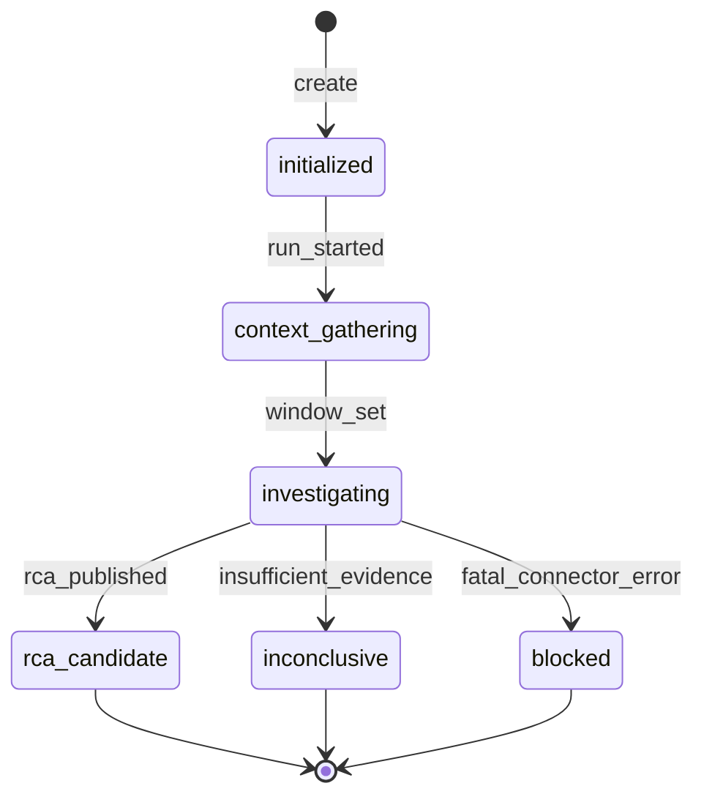

# LLD 01 — Domain model

Semantic meaning: product docs [08-core-concepts](../../docs/08-core-concepts.md), [10-evidence-model](../../docs/10-evidence-model.md), [11-rca-model](../../docs/11-rca-model.md).  
Wire format: [api/openapi.yaml](../api/openapi.yaml).

## Identifiers

| Entity | Format | Example |
|--------|--------|---------|
| `investigation_id` | ULID string | `01J9Y2K5Q8Z7X6W5V4U3T2S1R0P` |
| `evidence_id` | ULID or deterministic playbook id | `ev_b03_alert_001` (playbook-stable for golden tests) |
| `hypothesis_id` | ULID or `hyp_b03_h1` | `hyp_b03_h1` |
| `event_seq` | int ≥ 1 | per investigation |

**Rule:** Playbook may use deterministic `ev_b03_*` ids for golden stability; API still validates as string ids.

## Enums

### InvestigationState

| Value | Meaning |
|-------|---------|
| `initialized` | Created; run not started |
| `context_gathering` | Run started; loading signal/window |
| `investigating` | Active evidence acquisition |
| `rca_candidate` | RCA written; run complete success path |
| `inconclusive` | Run complete; insufficient evidence |
| `blocked` | Run failed; connector or internal error |

Slice 0–1 transitions only use subset below.

### EvidenceStrength

`direct` | `derived` | `correlated` | `inferred` | `human_provided`

### EvidenceSourceType

`telemetry_log` | `telemetry_metric` | `telemetry_trace` | `change_deployment` | `context_service` | `alert` | `human`

### HypothesisStatus

`proposed` | `supported` | `weakened` | `rejected`

### RcaStatus

`confirmed` | `probable` | `possible` | `inconclusive` (per product RCA model)

B03 target: `probable`.

## Entities

### Investigation

| Field | Type | Notes |
|-------|------|-------|
| `id` | string | ULID |
| `benchmark_id` | string | e.g. `b03` |
| `state` | InvestigationState | |
| `created_at` | datetime UTC | |
| `updated_at` | datetime UTC | |
| `org_id` | string? | nullable, future tenancy |
| `environment_id` | string? | nullable |
| `incident_window` | TimeWindow? | set during run |
| `run_completed_at` | datetime? | set when run finishes |
| `run_count` | int | default 0; increment on successful run |

### TimeWindow

`start` (datetime), `end` (datetime)

### Signal (input)

| Field | Type | Notes |
|-------|------|-------|
| `kind` | `alert` \| `symptom` \| `manual` | |
| `fired_at` | datetime? | |
| `service` | string? | |
| `description` | string? | |
| `raw` | object? | optional passthrough |

### Evidence

| Field | Type | Notes |
|-------|------|-------|
| `id` | string | |
| `investigation_id` | string | |
| `source` | string | e.g. `fixture` |
| `source_type` | EvidenceSourceType | |
| `entity` | string | service or resource name |
| `observation` | string | human-readable observation |
| `event_time` | datetime | time of observed phenomenon |
| `retrieved_at` | datetime | time connector fetched |
| `strength` | EvidenceStrength | |
| `provenance` | EvidenceProvenance | |

### EvidenceProvenance

| Field | Type |
|-------|------|
| `fixture_path` | string? |
| `fixture_ref` | string? | e.g. `metrics/db.pool.utilization.jsonl#14` |
| `query` | object? | serialized QuerySpec |
| `connector` | string | `fixture_telemetry` |

### Hypothesis

| Field | Type |
|-------|------|
| `id` | string |
| `statement` | string |
| `status` | HypothesisStatus |
| `supporting_evidence_ids` | string[] |
| `contradicting_evidence_ids` | string[] |

### RcaClaim

| Field | Type |
|-------|------|
| `id` | string |
| `text` | string |
| `evidence_ids` | string[] |

### RcaTimelineEntry

`at` (datetime), `description` (string)

### Rca

| Field | Type |
|-------|------|
| `status` | RcaStatus |
| `summary` | string |
| `root_cause` | string |
| `contributing_factors` | string[] |
| `causal_chain` | string[] |
| `timeline` | RcaTimelineEntry[] |
| `affected_components` | string[] |
| `claims` | RcaClaim[] |
| `contradicting_evidence_ids` | string[] |
| `uncertainty` | string? |
| `evidence_gaps` | string[] |
| `remediation` | string[] |
| `observability_lessons` | string[] |

### InvestigationEvent

| Field | Type |
|-------|------|
| `seq` | int |
| `type` | string | catalog id |
| `occurred_at` | datetime |
| `payload` | dict |

## State machine (Slice 0–1)

**Invalid transitions (domain raises `InvalidStateTransition`):**

- `run` from `rca_candidate`, `inconclusive`, `blocked`
- Any transition from terminal states except no-op reads

## Invariants

1. `event_seq` strictly increases by 1 per append; no gaps after commit.
2. Every `RcaClaim.evidence_ids` must reference existing evidence on same investigation.
3. `incident_window.end` >= `incident_window.start`.
4. `run_count` >= 1 iff state is terminal after run.

## Cross-references

- Persistence: [04-persistence.md](04-persistence.md)
- Use cases: [02-application-use-cases.md](02-application-use-cases.md)
